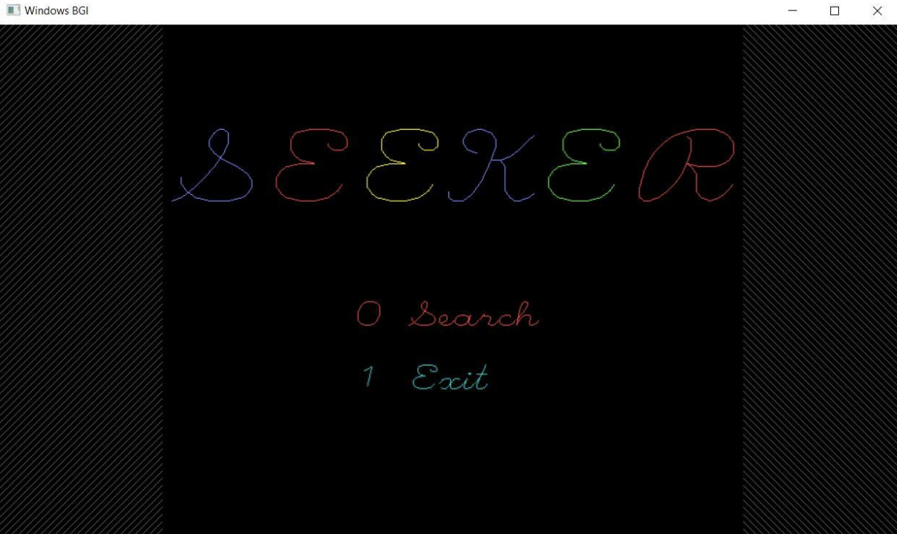
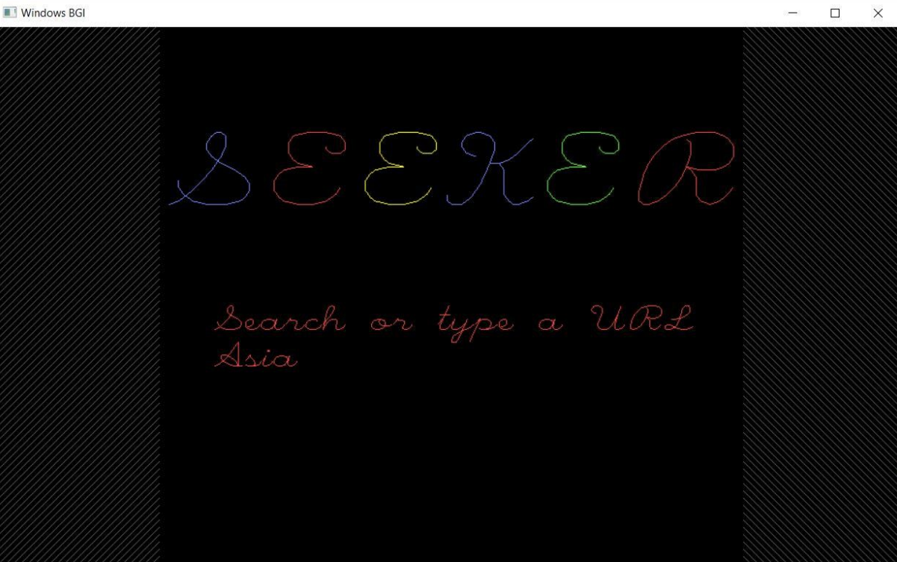
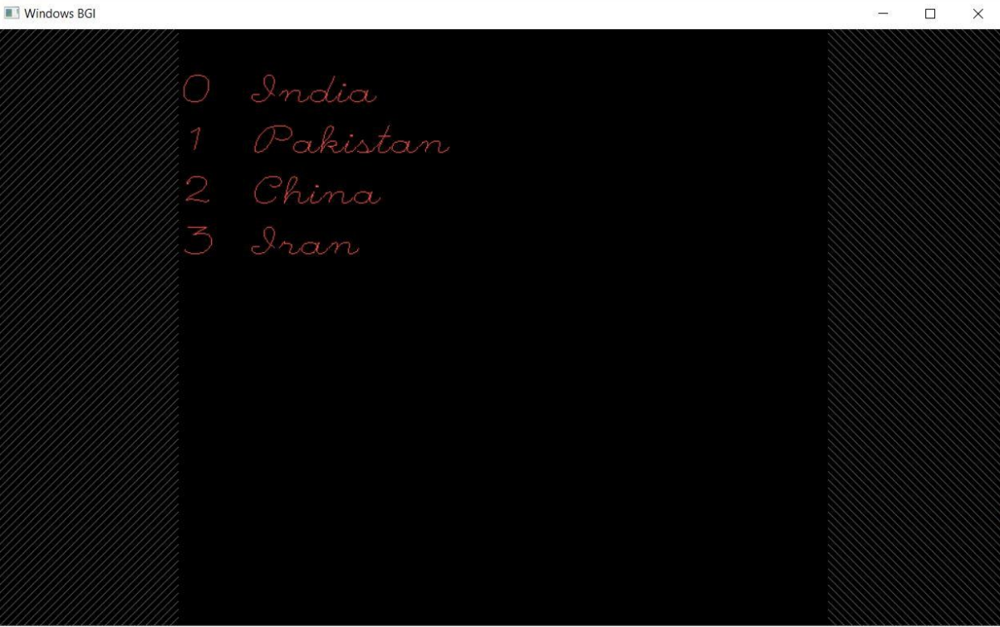
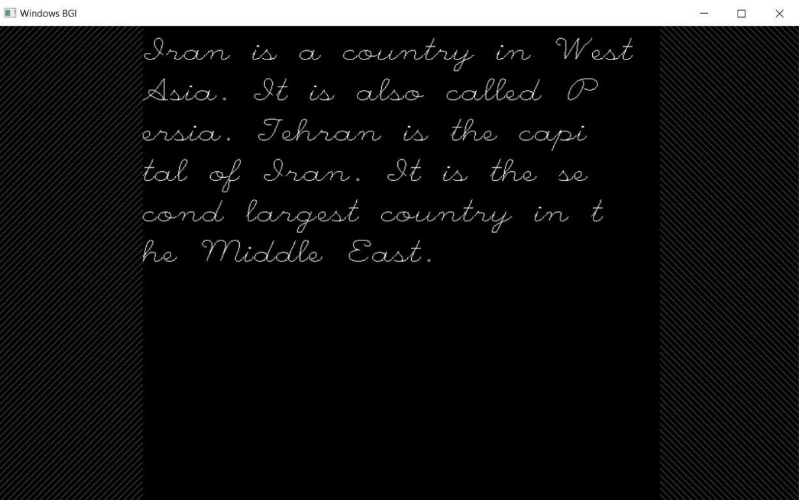

## Simple Search Engine for Files

This is a simple GUI based search engine made completely using C++. It assumes you have a file called `country.dat` in the same directory as the source file. The file should have been created and written into with a function such as the following.

```cpp
void write_record() {
    ofstream outFile;
    outFile.open("country.dat", ios::binary | ios::app);
    Country obj;
    obj.setData();
    outFile.write((char*)&obj, sizeof(obj));
    outFile.close();
}
```

This is a project I made in Class XII. I'm totally aware this project is pretty simple and follows some pretty horrendous coding practices. But it was one of the first projects I made and I would like to preserve it for nostalgia's sake.

### What does this do?
The user can enter any word that they please. The output would be a bunch of file names ranked according to the frequency of the entered search word in the corresponding file. The user can then select any file to display its contents.  

The hardest part of the project was coding the GUI. The `graphics.h` library is very outdated and the code does not even run on most of the modern operating systems. But learning it was fun!  


## The UI





